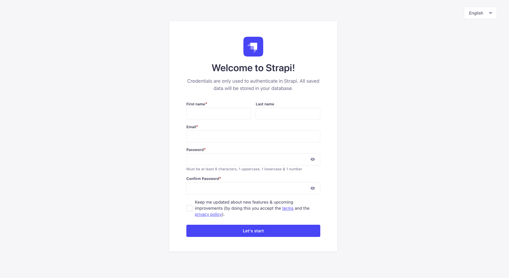
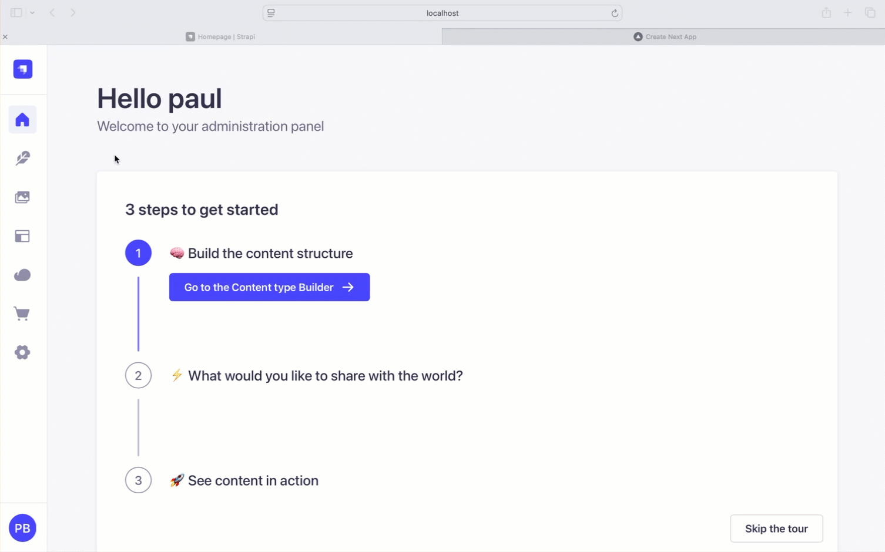

# When to use Strapi Lifecycle Hooks

After the update to Strapi v5, lifecycle hooks are no longer the recommended approach for most use cases. Instead, we recommend using Strapi's document service middleware. 

You can read more about it in the [Strapi Document Service Middleware](https://strapi.io/blog/what-are-document-service-middleware-and-what-happened-to-lifecycle-hooks-1).

If you are using Strapi v4, then lifecycle hooks are still the recommended approach. You can read more about it in the [Strapi Lifecycle Hooks v4](https://docs-v4.strapi.io/dev-docs/backend-customization/models#available-lifecycle-events).

However, if you are using Strapi v5, you should use the document service middleware.

## So, when should you use lifecycle hooks?

Lifecycle hooks are still useful for the following use cases:

- When you want to do something using the "users-permissions" plugin,
- When you want to do something using the "upload package",

In this blog post, we will examine an example of how to use lifecycle hooks to create a **user profile** when a **user** is created.

We will have two hooks:

- `afterCreate`: Create a user profile when a user is created.
- `beforeDelete`: Delete the user profile when a user is deleted.

This will show you how to create and inject lifecycle hooks in Strapi.

Instead of building our project from scratch, we will use the following project: [Strapi Lifecycle Hooks Example](https://github.com/PaulBratslavsky/strapi-next-strapi-lifecycle-example).

## Setup

First, clone the repository:

```bash
git clone https://github.com/PaulBratslavsky/strapi-next-strapi-lifecycle-example 
```

Then install the dependencies:

```bash
cd strapi-next-strapi-lifecycle-example
yarn setup
```

Then start both Strapi and Next.js projects by running the following command in the root of the project:

```bash
yarn dev
```

You should now be able to access your project at:

- [http://localhost:3000](http://localhost:3000) (Next.js project)
- [http://localhost:1337](http://localhost:1337) (Strapi project)

Navigate to the Strapi project and create your first **Admin User**.




Now that our project runs, let's review the quick demo and dive into the code.



You may notice that we are redirected to the **Dashboard** page after we log in and get a `not found` error. That is because we have not created it yet.

The goal is to focus on Strapi lifecycle hooks and how to use them.

You notice that when you submit, we create a new user and a user profile for that user with additional information, such as `fullName` and `bio`.

## Why Would We Want to Do This?

This approach helps separate a user's profile information from sensitive data, enhancing security and privacy.

You won't need to expose the user endpoint to the client.

Instead, you can use the `me` endpoint to retrieve just the user's ID, which can then be used to fetch the user's profile information.

Alternatively, you can create a custom endpoint to fetch the user's profile information instead and completely lock down the user endpoint.

Let's jump into the code and see how we can achieve this.


## Registering Lifecycle Hooks in Bootstrap Method

We will register the lifecycle hooks in the `bootstrap` function in the `src/index.ts` file.

You can learn more about the bootstrap method in the [Strapi Bootstrap Method](https://docs-v4.strapi.io/dev-docs/backend-customization/models#available-lifecycle-events).

The `bootstrap()` function is run before the back-end server starts but after the Strapi application has been setup, so you can access anything from the strapi object.

Take a look at the code in `src/index.ts`, where we programmatically register the lifecycle hooks.

```ts
bootstrap({ strapi }: { strapi: Core.Strapi }) {
    // Registering a lifecycle subscriber for the users-permissions plugin
    strapi.db.lifecycles.subscribe({
      models: ["plugin::users-permissions.user"], // Applies only to users in users-permissions

      /**
       * Lifecycle hook triggered after a new user is created.
       * Ensures that a user profile is created with either the provided full name and bio
       * or a default generated username and bio if missing.
       * @param {any} event - The event object containing the created user's details.
       */
      async afterCreate(event: any) {
        const { result, params } = event;
        const fullName = params?.data?.fullName || generateUsername();
        const bio = params?.data?.bio || "No bio yet";
        await createUserProfile(result.id, fullName, bio);
      },

      /**
       * Lifecycle hook triggered before a user is deleted.
       * Ensures that the associated user profile is also removed.
       * @param {any} event - The event object containing the details of the user being deleted.
       */
      async beforeDelete(event: any) {
        const { params } = event;
        const idToDelete = params?.where?.id;
        await deleteUserProfile(idToDelete);
      },
    });
  },
```

This function registers a lifecycle subscriber in Strapi's database system to handle specific user creation and deletion actions.

**After a user is created (afterCreate):**

- It checks if the `fullName` and `bio` fields are provided in the request.
- If missing, it assigns a generated username and a default bio.
- It then creates a corresponding user profile using createUserProfile.

**Before a user is deleted (beforeDelete):**

- It retrieves the user ID that is about to be deleted.
- Calls deleteUserProfile to remove the associated profile.

This setup ensures that every user has a profile upon creation and that their profile is deleted when the user is removed.

We also have some helper functions to create and delete the user profile.

- `checkIfUserProfileExists`: Checks if a user profile already exists in the database for a given user ID.
- `createUserProfile`: Creates a user profile for a user.
- `deleteUserProfile`: Deletes a user profile for a user.
- `generateUsername`: Generates a random username for a user if the fullName is not provided.

The full completed code looks like the following:

```ts   
// TODO: This only applies to the users-permissions plugin.
// For anything else, please reference the following guide:
// https://strapi.io/blog/what-are-document-service-middleware-and-what-happened-to-lifecycle-hooks-1

import type { Core } from "@strapi/strapi";

/**
 * Generates a random username by combining an adjective, a noun, and a 4-digit number.
 * @returns {string} A randomly generated username.
 */
function generateUsername(): string {
  const adjectives = ["Swift", "Brave", "Clever", "Mighty", "Silent", "Witty", "Bold", "Eager"];
  const nouns = ["Tiger", "Eagle", "Shark", "Wolf", "Falcon", "Panda", "Dragon", "Hawk"];
  const randomNumber = Math.floor(1000 + Math.random() * 9000); // Generates a 4-digit random number

  // Select a random adjective and noun from the arrays
  const randomAdjective = adjectives[Math.floor(Math.random() * adjectives.length)];
  const randomNoun = nouns[Math.floor(Math.random() * nouns.length)];

  // Return the concatenated username
  return `${randomAdjective}${randomNoun}${randomNumber}`;
}

/**
 * Checks if a user profile already exists in the database for a given user ID.
 * @param {string} userId - The ID of the user to check.
 * @returns {Promise<any>} The user profile if found, otherwise an empty array.
 */
async function checkIfUserProfileExists(userId: string) {
  console.log("FROM FIND USER PROFILE FUNCTION");
  console.log("userId", userId);

  // Query the database to find any existing user profile associated with the given user ID
  const existingUserProfile = await strapi
    .documents("api::user-profile.user-profile")
    .findMany({
      filters: {
        user: {
          id: {
            $eq: userId, // Filter where the user ID matches
          },
        },
      },
    });

  return existingUserProfile;
}

/**
 * Creates a new user profile if one does not already exist.
 * @param {string} userId - The ID of the user for whom the profile is being created.
 * @param {string} fullName - The full name of the user.
 * @param {string} bio - The user's bio.
 */
async function createUserProfile(userId: string, fullName: string, bio: string) {
  const userProfile = await checkIfUserProfileExists(userId);

  // If a profile already exists, log a message and return without creating a new one
  if (userProfile.length > 0) {
    console.log("USER PROFILE ALREADY EXISTS");
    return;
  }

  // Create a new user profile with the provided user ID, full name, and bio
  await strapi.documents("api::user-profile.user-profile").create({
    data: {
      user: userId,
      fullName: fullName,
      bio: bio,
    },
  });
}

/**
 * Deletes a user's profile if it exists.
 * @param {string} userId - The ID of the user whose profile should be deleted.
 */
async function deleteUserProfile(userId: string) {
  const userProfile = await checkIfUserProfileExists(userId);

  // If a profile exists, delete it from the database
  if (userProfile.length > 0) {
    await strapi.documents("api::user-profile.user-profile").delete({
      documentId: userProfile[0].documentId, // Use the document ID of the first found profile
    });
  }
}

export default {
  /**
   * An asynchronous register function that runs before
   * your application is initialized.
   *
   * This gives you an opportunity to extend code.
   */
  register(/* { strapi }: { strapi: Core.Strapi } */) {},

  /**
   * An asynchronous bootstrap function that runs before
   * your application gets started.
   *
   * This gives you an opportunity to set up your data model,
   * run jobs, or perform some special logic.
   */
  bootstrap({ strapi }: { strapi: Core.Strapi }) {
    // Registering a lifecycle subscriber for the users-permissions plugin
    strapi.db.lifecycles.subscribe({
      models: ["plugin::users-permissions.user"], // Applies only to users in users-permissions

      /**
       * Lifecycle hook triggered after a new user is created.
       * Ensures that a user profile is created with either the provided full name and bio
       * or a default generated username and bio if missing.
       * @param {any} event - The event object containing the created user's details.
       */
      async afterCreate(event: any) {
        const { result, params } = event;
        const fullName = params?.data?.fullName || generateUsername();
        const bio = params?.data?.bio || "No bio yet";
        await createUserProfile(result.id, fullName, bio);
      },

      /**
       * Lifecycle hook triggered before a user is deleted.
       * Ensures that the associated user profile is also removed.
       * @param {any} event - The event object containing the details of the user being deleted.
       */
      async beforeDelete(event: any) {
        const { params } = event;
        const idToDelete = params?.where?.id;
        await deleteUserProfile(idToDelete);
      },
    });
  },
};

```

The last piece of the puzzle is to ensure that we can pass additional fields on the user creation.

To allow extra fields like `fullName` and `bio`, we need to update the `config/plugins.ts` file with the following:

```ts
export default () => ({
  "users-permissions": {
    config: {
      register: {
        allowedFields: ["fullName", "bio"],
      },
    },
  },
});
```

This will allow us to pass the `fullName` and `bio` and access them in the `afterCreate` hook. 

## Conclusion

In this blog post we learned how to use Strapi lifecycle hooks to create a user profile when a user is created.

We also learned how to use the `bootstrap` method to register the lifecycle hooks.

We also learned how to use the `config/plugins.ts` file to allow extra fields to be passed on to the user creation.

I hope you enjoyed this blog post. If you have any questions, please leave a comment below.

## Github Project Repo
You can find the complete code for this project in the following [Github repo](https://github.com/PaulBratslavsky/strapi-next-strapi-lifecycle-example).


## Strapi Open Office Hours
If you have any questions about Strapi 5 or just would like to stop by and say hi, you can join us at **Strapi's Discord Open Office Hours** Monday through Friday at 12:30 pm - 1:30 pm CST: [Strapi Discord Open Office Hours](https://discord.com/invite/strapi)


